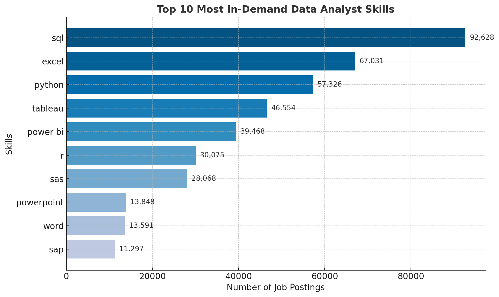

# Introduction
This SQL project dives into the job market insights, with the database of data job postings in 2024. In this project, top-paying jobs and high-demand skills are explored to provide valuabe information for IT job seekers who aim to advance their career.

Look into the SQL queires [here](/project_sql/)!

# Background
As a recent IT graduate who's seeking for their entry to the industry, I often find myself seeking for guidance and direction to navigate my career path. Aspire to be a data analyst, I looked into the job market data (including job title, location, salary, and required skills) to identify the relevant patterns and trends.

### The SQL queries in this project help to answer my following questions:

1. Which data analyst roles offer the highest salaries?

2. What abilities or expertise are needed for these high-paying positions?

3. Which skills are currently most sought after in the data analytics field?

4. Which competencies tend to lead to better-paying opportunities?

5. What are the best skills to focus on developing for career growth?

# Tools Used
To explore the IT job market data, I have utilized the following tools:

1. **SQL:** Core tool for querying databases and extracting insights.

2. **PostgreSQL:** Database system used to manage job posting data.

3. **Visual Studio Code:** Primary environment for writing and running SQL queries.

4. **Git & GitHub:** Used for version control, collaboration, and sharing analysis.

# Key Findings
## 1. Top-Paying Data Roles
To identify the **10 highest-paying** opportunities in the field, data analyst roles are analyzed by average annual salary and location, focusing on remote positions.

```sql
SELECT
    job_id,
    job_title,
    job_location,
    name AS company_name,
    job_schedule_type,
    salary_year_avg,
    job_posted_date :: DATE
FROM job_postings_fact
LEFT JOIN company_dim ON job_postings_fact.company_id = company_dim.company_id
WHERE job_title LIKE '%Data Analyst%' AND 
    job_location = 'Anywhere' AND
    salary_year_avg IS NOT NULL
ORDER BY salary_year_avg DESC
LIMIT 10;
```

*Bar graph visualizing the count of skills for the top 10 paying jobs for data analysts*

**Based on the query's output:**
- Majority are senior or principal-level roles (e.g., Principal Data Analyst, Director, Senior Data Analyst).

- A few specialized roles appear, such as Marketing Data Analyst, AV Performance Analysis, and ERM Data Analyst.

- Leadership-focused titles like Director and Principal dominate the upper salary range.

## 2. Skills Required by High-Salary Roles
Based on the identified high-paying jobs, the associated essential skills are analyzed by joining the job postings and skills data.

```sql
WITH top_paying_jobs AS (
    SELECT
    job_id,
    job_title,
    name AS company_name,
    salary_year_avg,
    job_posted_date :: DATE
    FROM job_postings_fact
    LEFT JOIN company_dim ON job_postings_fact.company_id = company_dim.company_id
    WHERE job_title_short = 'Data Analyst' AND 
        job_location = 'Anywhere' AND
        salary_year_avg IS NOT NULL
    ORDER BY salary_year_avg DESC
    LIMIT 10
)

SELECT
    skills_dim.skills,
    COUNT(skills_dim.skills) AS skill_count
FROM top_paying_jobs
INNER JOIN skills_job_dim ON top_paying_jobs.job_id = skills_job_dim.job_id
INNER JOIN skills_dim ON skills_job_dim.skill_id = skills_dim.skill_id
GROUP BY skills_dim.skills
ORDER BY skill_count DESC
LIMIT 10;
```
**Based on the query's output:**

- High-paying analyst roles require a blend of technical depth (SQL, Python, cloud) 
and business-facing skills (visualization, reporting).

- Cloud and big data tools are heavily represented, suggesting companies prioritize scalable, 
distributed analytics environments.

- Collaboration platforms appear frequently, reflecting the teamwork demands of remote roles.

**Implications for job seekers:**

- To target top-paying remote analyst positions, focus on SQL + Python as a baseline.

- Add at least one major cloud platform (Azure, AWS, or Snowflake) 
and big data processing skills (PySpark, Pandas, Hadoop).

- Master a leading visualization tool (Tableau or Power BI) to complement technical skills.

- Familiarity with team collaboration tools can improve adaptability in remote environments.

# 3. Most Demanded Skills for Data Analysts
To assist job seekers understand the job market demands, 10 most common skills in job postings for technical skill improvement purposes. 

```sql
SELECT 
    skills_dim.skills,
    COUNT(skills_job_dim.job_id) AS demand_count
FROM job_postings_fact
INNER JOIN skills_job_dim ON job_postings_fact.job_id = skills_job_dim.job_id
INNER JOIN skills_dim ON skills_job_dim.skill_id = skills_dim.skill_id
WHERE job_title_short = 'Data Analyst'
GROUP BY skills_dim.skills
ORDER BY demand_count DESC
LIMIT 10;
```
**Based on the query's output:**
- Mastery of SQL and Excel is essential to be competitive in almost any data analyst role.

- Adding Python (for automation and advanced analysis) plus at least one BI/visualization tool 
(Tableau or Power BI) will cover the majority of employer requirements.

- Developing both technical skills (querying, coding) and communication tools (visualization, presentation) 
creates a well-rounded skill profile.



*Bar graph visualization of 10 most demanded data analyst skills*

# 4. Highly Valued Skills
The relationship between average salaries and required skills is analyzed to assess how these skills are valued in the job market.

```sql
SELECT 
    skills_dim.skills,
    ROUND(AVG(salary_year_avg),2) AS average_salary
FROM job_postings_fact
INNER JOIN skills_job_dim ON job_postings_fact.job_id = skills_job_dim.job_id
INNER JOIN skills_dim ON skills_job_dim.skill_id = skills_dim.skill_id
WHERE 
    job_title_short = 'Data Analyst' AND 
    salary_year_avg IS NOT NULL
GROUP BY skills_dim.skills
ORDER BY average_salary DESC
LIMIT 25;
```
**Based on the query's output:**
- Highest-paying skill: svn stands out dramatically at $400,000 average salary, 
which likely skewed by a very small number of high-paying niche roles rather than a broad market trend.

- Emerging tech pays well: Skills like Solidity, Couchbase, Golang, and MXNet command $149K–$179K, 
reflecting demand in blockchain, NoSQL databases, modern programming, and AI frameworks.

- Machine learning libraries such as Keras, PyTorch, Hugging Face, and TensorFlow all cluster around $120K–$127K, 
showing strong value for advanced analytics & AI skills.

- DevOps & automation tools (Terraform, Ansible, Puppet, Airflow) also rank high, which suggesting crossover demand 
for analysts who can work with data pipelines and deployment environments.

- Collaboration & version control platforms (GitLab, Atlassian, Bitbucket, Notion) average around $116K–$134K, 
showing that employers value analysts who can work within structured development workflows.

# 5. Essential Skills for Success
By analyzing both demand and salary data, this query identifies skills that are highly sought after and well-compensated, providing a strategic guide for skill development.

```sql
SELECT 
    skills_dim.skill_id,
    skills_dim.skills,
    COUNT(skills_job_dim.job_id) AS demand_count,
    ROUND(AVG(job_postings_fact.salary_year_avg), 0) AS avg_salary
FROM job_postings_fact
INNER JOIN skills_job_dim ON job_postings_fact.job_id = skills_job_dim.job_id
INNER JOIN skills_dim ON skills_job_dim.skill_id = skills_dim.skill_id
WHERE
    job_title_short = 'Data Analyst'
    AND salary_year_avg IS NOT NULL
    AND job_work_from_home = True 
GROUP BY
    skills_dim.skill_id
HAVING
    COUNT(skills_job_dim.job_id) > 10
ORDER BY
    avg_salary DESC,
    demand_count DESC
LIMIT 25;
```
| Skill ID | Skills     | Demand Count | Average Salary ($) |
|----------|------------|--------------|-------------------:|
| 8        | go         | 27           |            115,320 |
| 234      | confluence | 11           |            114,210 |
| 97       | hadoop     | 22           |            113,193 |
| 80       | snowflake  | 37           |            112,948 |
| 74       | azure      | 34           |            111,225 |
| 77       | bigquery   | 13           |            109,654 |
| 76       | aws        | 32           |            108,317 |
| 4        | java       | 17           |            106,906 |
| 194      | ssis       | 12           |            106,683 |
| 233      | jira       | 20           |            104,918 |

*Table of the most optimal skills for data analyst sorted by salary*

**Based on the query's output:**
- Cloud & Big Data expertise (Azure, Snowflake, Hadoop, BigQuery, AWS) shows consistent premium salaries, 
which aligns with the shift toward distributed analytics and AI pipelines.

- End-to-end skills (Python + SQL + BI + Cloud) are increasingly valued, reflecting employers’ preference 
for analysts who can build, analyse, and present without heavy reliance on separate teams.

- Traditional BI tools (Tableau, SAS, Oracle) retain relevance, especially in enterprise and finance sectors, 
despite the rise of newer stacks.

**Career Strategy**

Step 1: Secure core skills for job stability — Python, R, Tableau, SQL variant.

Step 2: Layer in one niche, high-salary tech (Snowflake, Hadoop, Go) to stand out.

Step 3: Monitor emerging tools in cloud analytics; early adoption leads to premium pay before market saturation.

# Lessons Learned
Throughout this project, I’ve enhanced my SQL skills:

- Advanced Querying: Skilled in combining tables and using WITH clauses to create powerful temporary tables.

- Data Aggregation: Proficient with GROUP BY and aggregate functions like COUNT() and AVG() to summarize data effectively.

- Analytical Problem-Solving: Transformed real-world questions into actionable, insightful SQL queries.

# Conclusion
This project provided a comprehensive look into the 2024 data analyst job market, highlighting the intersection of salary, demand, and skills. By leveraging SQL to analyze job postings, I identified the highest-paying roles, the most sought-after skills, and the competencies that drive career growth.

### Key takeaways:

1. Top-paying roles are typically senior, specialized, or leadership-focused positions, often requiring a blend of technical and business skills.

2. In-demand skills like SQL, Python, and BI tools form the foundation for competitiveness, while cloud and big data expertise (Azure, Snowflake, Hadoop) can significantly boost earning potential.

3. Strategic skill development—combining core analytics skills with emerging technologies—offers a clear roadmap for IT graduates and aspiring data analysts seeking remote or high-paying opportunities.

4. Overall, this project reinforced the value of data-driven decision-making for career planning and allowed me to strengthen my SQL, data aggregation, and analytical problem-solving skills, equipping me with practical experience to navigate the IT job market successfully.
